> 📊 **Version Comparison Available:** Jump to the latest changes via [Markdown](version_comparison.md) or [HTML](version_comparison.html).

---

## Overview

- Shape: **1338 rows** × **7 columns**
- Memory usage: **73 KB**
- **Data Type Distribution:**
  - Numeric: 4
  - Categorical: 3
  - Text: 0
  - Datetime: 0

> ⚠️ **Data Quality Issue: Mixed Data Types Detected**
>
> The following columns contain mixed data types (e.g., numeric and text values):
>
> - **bmi**: Contains 2 non-numeric values in numeric column
> - **children**: Contains 2 non-numeric values in numeric column
>
> **Recommendation:** Normalize data types (convert to consistent format) or split into separate columns.

**Column Data Types:**

| Column   | Type        | Pandas dtype   | Mixed Types   |
|:---------|:------------|:---------------|:--------------|
| age      | numeric     | int64          |               |
| sex      | categorical | object         |               |
| bmi      | numeric     | float64        | ⚠️ Mixed      |
| children | numeric     | float64        | ⚠️ Mixed      |
| smoker   | categorical | object         |               |
| region   | categorical | object         |               |
| charges  | numeric     | float64        |               |

---

## Sample Records

|   age | sex    |    bmi |   children | smoker   | region    |   charges |
|------:|:-------|-------:|-----------:|:---------|:----------|----------:|
|    19 | female | 27.9   |          0 | yes      | southwest |  16884.9  |
|    18 | male   | 33.77  |          1 | yes      | southeast |   1725.55 |
|    28 | male   | 33     |          3 | no       | southeast |   4449.46 |
|    33 | male   | 22.705 |          0 | no       | northwest |  21984.5  |
|    32 | male   | 28.88  |          0 | no       | northwest |   3866.86 |
|    31 | female | 25.74  |        nan | no       | southeast |   3756.62 |
|    46 | female | 33.44  |          1 | no       | southeast |   8240.59 |
|    37 | female | 27.74  |          3 | no       | northwest |   7281.51 |

---

## Numeric Column Insights

| column   |   count |      mean |   median |   variance |       std |   min |       max |   skewness |   kurtosis |   outliers |   missing |   missing_pct |   shapiro_p | suggestions                                                                                                                                                                                                                                       |
|:---------|--------:|----------:|---------:|-----------:|----------:|------:|----------:|-----------:|-----------:|-----------:|----------:|--------------:|------------:|:--------------------------------------------------------------------------------------------------------------------------------------------------------------------------------------------------------------------------------------------------|
| age      |    1338 | 39.2      | 39       | 197        | 14        |    18 | 64        |     0.0556 |      -1.24 |          0 |         0 |         0     |    5.69e-22 | ['Standardize or normalize (variance much larger than mean).', 'Shapiro–Wilk test: not normal, consider transformation or non-parametric models.']                                                                                                |
| bmi      |    1336 | 30.6      | 30.4     |  41.7      |  6.46     |   -45 | 53.1      |    -0.95   |      13.5  |         27 |         2 |         0.149 |    4.83e-22 | ['Shapiro–Wilk test: not normal, consider transformation or non-parametric models.']                                                                                                                                                              |
| children |    1336 |  1.12     |  1       |   1.91     |  1.38     |     0 | 25        |     4.52   |      66.2  |         20 |         2 |         0.149 |    2.64e-43 | ['Apply log or Box-Cox transform to reduce right skew.', 'Shapiro–Wilk test: not normal, consider transformation or non-parametric models.']                                                                                                      |
| charges  |    1338 |  1.32e+04 |  9.3e+03 |   1.46e+08 |  1.21e+04 |     0 |  6.38e+04 |     1.52   |       1.63 |        137 |         0 |         0     |    1.19e-36 | ['Apply log or Box-Cox transform to reduce right skew.', 'Standardize or normalize (variance much larger than mean).', 'Winsorize or remove outliers (>5%).', 'Shapiro–Wilk test: not normal, consider transformation or non-parametric models.'] |

> **Suggested Transforms / Actions:**
>
> - **age**
  - Standardize or normalize (variance much larger than mean).
  - Shapiro–Wilk test: not normal, consider transformation or non-parametric models.
- **bmi**
  - Shapiro–Wilk test: not normal, consider transformation or non-parametric models.
- **children**
  - Apply log or Box-Cox transform to reduce right skew.
  - Shapiro–Wilk test: not normal, consider transformation or non-parametric models.
- **charges**
  - Apply log or Box-Cox transform to reduce right skew.
  - Standardize or normalize (variance much larger than mean).
  - Winsorize or remove outliers (>5%).
  - Shapiro–Wilk test: not normal, consider transformation or non-parametric models.

**Insights:**

- **age**
  - Shows high dispersion; standardization recommended.
  - Data is not normally distributed (shapiro p<6e-22); consider transformation.

- **bmi**
  - Data is not normally distributed (shapiro p<5e-22); consider transformation.

- **children**
  - Is strongly right-skewed; consider log transform.
  - Data is not normally distributed (shapiro p<3e-43); consider transformation.

- **charges**
  - Is strongly right-skewed; consider log transform.
  - Shows high dispersion; standardization recommended.
  - Contains many extreme values; winsorization or removal suggested.
  - Data is not normally distributed (shapiro p<1e-36); consider transformation.

---

## Categorical Column Insights

| column   |   count |   cardinality | unique_sample                                                              |   top_freq | mode      |   missing |   missing_pct | label_inconsistency   |   max_imbalance | has_mixed_types   | suggestions                                                                                                                                             |
|:---------|--------:|--------------:|:---------------------------------------------------------------------------|-----------:|:----------|----------:|--------------:|:----------------------|----------------:|:------------------|:--------------------------------------------------------------------------------------------------------------------------------------------------------|
| sex      |    1338 |             3 | ['male', 'female', 'nan']                                                  |        675 | male      |         1 |        0.0747 | False                 |           0.504 | False             | ['Group rare categories (<1%) into "Other".', 'One-hot encoding is suitable.']                                                                          |
| smoker   |    1338 |             3 | ['no', 'yes', 'nan']                                                       |       1061 | no        |         2 |        0.149  | False                 |           0.793 | False             | ['Group rare categories (<1%) into "Other".', 'One-hot encoding is suitable.', 'Highly imbalanced (>70% one class); consider resampling or weighting.'] |
| region   |    1338 |             7 | ['southeast', 'northwest', 'southwest', 'northeast', 'nan', 'us', 'india'] |        363 | southeast |         3 |        0.224  | False                 |           0.271 | False             | ['Group rare categories (<1%) into "Other".', 'One-hot encoding is suitable.']                                                                          |

> **Suggested Transforms / Actions:**
>
> - **sex**
  - Group rare categories (<1%) into "Other".
  - One-hot encoding is suitable.
- **smoker**
  - Group rare categories (<1%) into "Other".
  - One-hot encoding is suitable.
  - Highly imbalanced (>70% one class); consider resampling or weighting.
- **region**
  - Group rare categories (<1%) into "Other".
  - One-hot encoding is suitable.

**Insights:**

- **sex**
  - Has manageable cardinality (3); one-hot encoding is suitable.

- **smoker**
  - Has manageable cardinality (3); one-hot encoding is suitable.
  - Is highly imbalanced (>70% in one class); consider resampling or reweighting.

- **region**
  - Has manageable cardinality (7); one-hot encoding is suitable.

---

## Missingness

| column   |   missing |   missing_pct | suggestions                           |
|:---------|----------:|--------------:|:--------------------------------------|
| sex      |         1 |        0.0747 | ['Add missing value indicator flag.'] |
| bmi      |         2 |        0.149  | ['Add missing value indicator flag.'] |
| children |         2 |        0.149  | ['Add missing value indicator flag.'] |
| smoker   |         2 |        0.149  | ['Add missing value indicator flag.'] |
| region   |         3 |        0.224  | ['Add missing value indicator flag.'] |

> **Suggested Transforms / Actions:**
>
> - **sex**
  - Add missing value indicator flag.
- **bmi**
  - Add missing value indicator flag.
- **children**
  - Add missing value indicator flag.
- **smoker**
  - Add missing value indicator flag.
- **region**
  - Add missing value indicator flag.

**Insights:**

- **sex**
  - Has minor missingness (0.1%); add a missing flag feature.

- **bmi**
  - Has minor missingness (0.1%); add a missing flag feature.

- **children**
  - Has minor missingness (0.1%); add a missing flag feature.

- **smoker**
  - Has minor missingness (0.1%); add a missing flag feature.

- **region**
  - Has minor missingness (0.2%); add a missing flag feature.

---

## Correlation/Association

**Pearson Correlation:**

|    age |    bmi |   children |   charges |
|-------:|-------:|-----------:|----------:|
| 1      | 0.0997 |     0.0547 |    0.298  |
| 0.0997 | 1      |     0.0103 |    0.193  |
| 0.0547 | 0.0103 |     1      |    0.0908 |
| 0.298  | 0.193  |     0.0908 |    1      |

**Cramér’s V (Categorical):**

|      sex |   smoker |   region |
|---------:|---------:|---------:|
| nan      |   0.0606 |   0.0448 |
|   0.0606 | nan      |   0.0676 |
|   0.0448 |   0.0676 | nan      |

**Insights:**

---

## Visual Summary

### Numeric Distributions
- **age**

  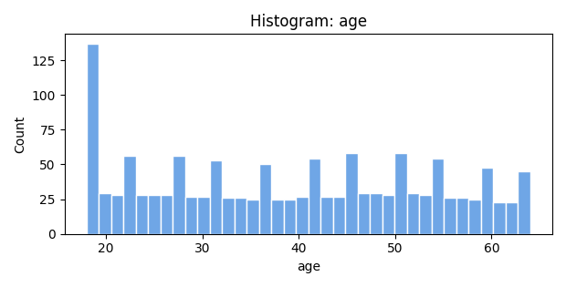 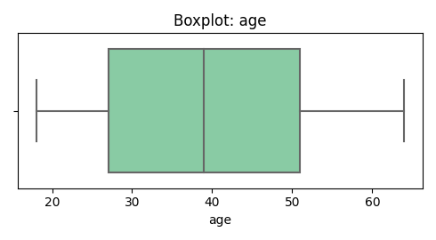

- **bmi**

  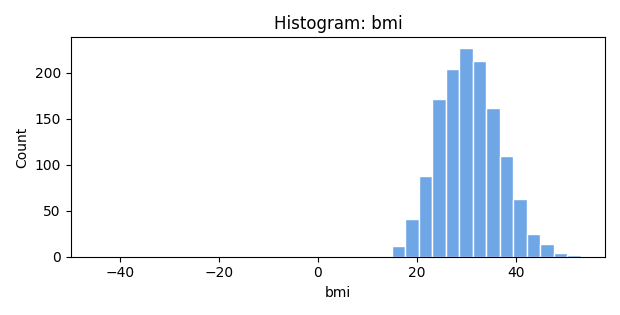 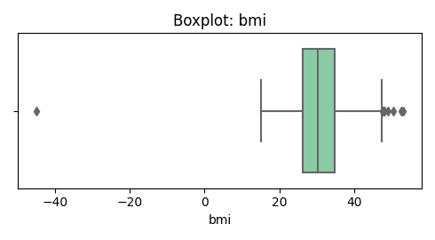

- **children**

  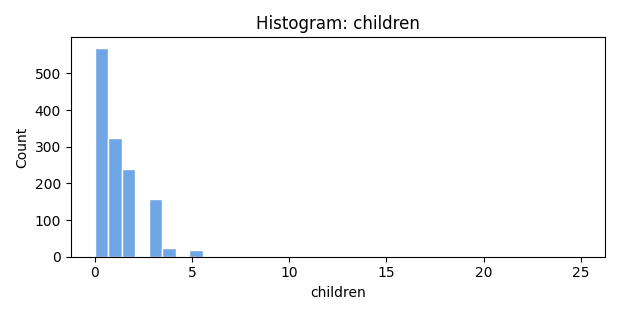 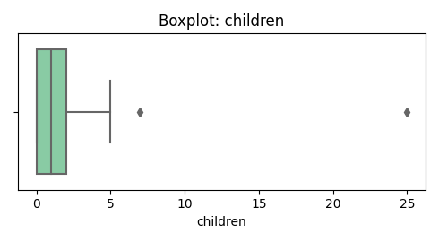

- **charges**

  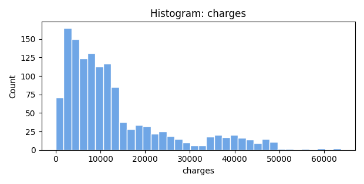 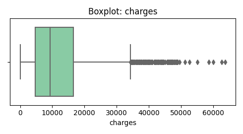

### Categorical Distributions
- **sex**

  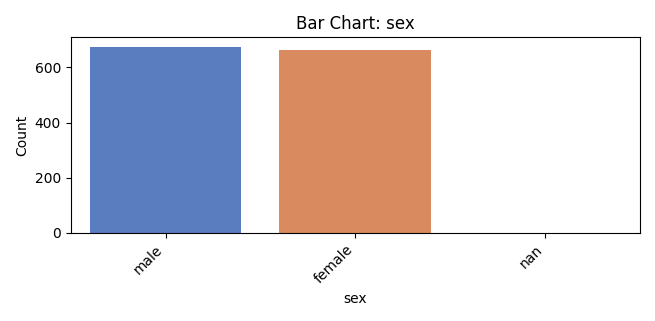

- **smoker**

  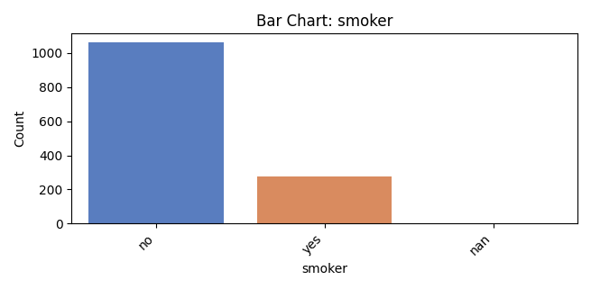

- **region**

  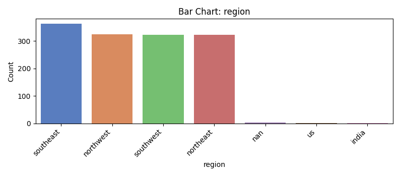

### Missingness Map

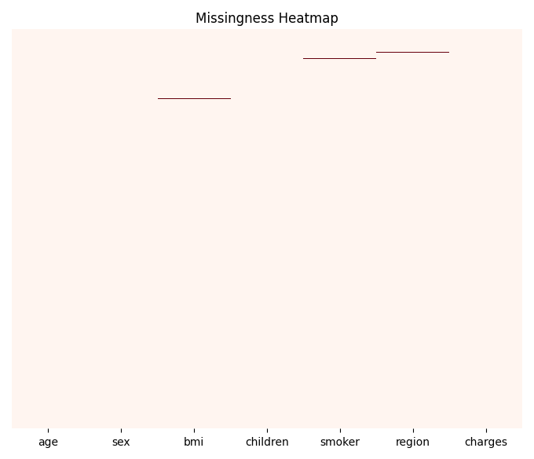

### Correlation Heatmap

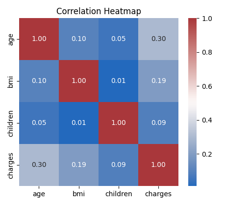

