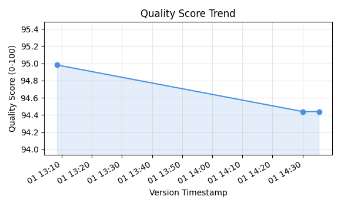
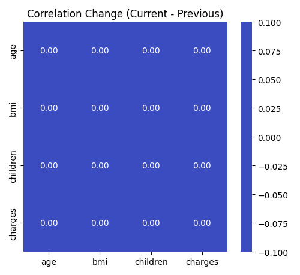

# Version Comparison Report

**Dataset:** insurance

> 📘 Back to [EDA Report](eda_report.md) · [HTML](eda_report.html)

---

## 🏆 Best Version

**Best Quality Version:** 20251201_130826

- **Quality Score:** 94.98/100
- **Timestamp:** 2025-12-01 13:08:30
- **Shape:** 1338 rows × 7 columns
- **Missing Data:** 0.00%

- **Grade:** A (Excellent)

---
## Version History

**Data Source:** insurance

| Version ID | Timestamp | Quality Score | Shape | Missing % |
|------------|-----------|---------------|-------|----------|
| 20251201_143526 | 2025-12-01 14:35:29 | 94.44/100 | 1338×7 | 0.11% |
| 20251201_143001 | 2025-12-01 14:30:05 | 94.44/100 | 1338×7 | 0.11% |
| 20251201_130826 | 2025-12-01 13:08:30 | 94.98/100 | 1338×7 | 0.00% |

---
## Version Comparison

**Version 1:** 20251201_143001 (2025-12-01 14:30:05)
**Version 2:** 20251201_143526 (2025-12-01 14:35:29)

### Quality Score Comparison

| Metric | Version 1 | Version 2 | Difference |
|--------|-----------|-----------|------------|
| **Quality Score** | 94.44/100 | 94.44/100 | +0.00 |

⚖️ **Both versions have similar quality** (score: 94.44)

### Dataset Shape

- **No change:** 1338 rows × 7 columns

### Column Changes

- **No column changes** (same columns in both versions)

### Missing Data Comparison

| Version | Missing % |
|---------|----------|
| Version 1 | 0.11% |
| Version 2 | 0.11% |
| **Change** | **+0.00%** |

➡️ **No change** in missing data percentage

### Quality Breakdown Comparison

| Component | Version 1 | Version 2 | Difference |
|-----------|-----------|-----------|------------|
| Completeness | 29.97 | 29.97 | +0.00 |
| Consistency | 25.00 | 25.00 | +0.00 |
| Distribution | 16.48 | 16.48 | +0.00 |
| Balance | 13.00 | 13.00 | +0.00 |
| Correlation | 10.00 | 10.00 | +0.00 |

### Recommendations

- Both versions have similar quality
- Choose based on other factors (timeliness, completeness, etc.)

---
## 📊 Detailed Version Comparison

**Previous Version:** 20251201_143001
**Current Version:** 20251201_143526

### 📈 Statistical Comparison (Numeric Columns)

| Column | Metric | Previous | Current | Change |
|--------|--------|----------|---------|--------|
| age | Mean | 39.21 | 39.21 | +0.00 (+0.0%) |
| age | Median | 39.00 | 39.00 | +0.00 (+0.0%) |
| age | Std | 14.05 | 14.05 | +0.00 (+0.0%) |
| age | Min | 18.00 | 18.00 | +0.00 (+0.0%) |
| age | Max | 64.00 | 64.00 | +0.00 (+0.0%) |
| bmi | Mean | 30.61 | 30.61 | +0.00 (+0.0%) |
| bmi | Median | 30.40 | 30.40 | +0.00 (+0.0%) |
| bmi | Std | 6.46 | 6.46 | +0.00 (+0.0%) |
| bmi | Min | -45.00 | -45.00 | +0.00 (-0.0%) |
| bmi | Max | 53.13 | 53.13 | +0.00 (+0.0%) |
| charges | Mean | 13203.00 | 13203.00 | +0.00 (+0.0%) |
| charges | Median | 9303.30 | 9303.30 | +0.00 (+0.0%) |
| charges | Std | 12076.03 | 12076.03 | +0.00 (+0.0%) |
| charges | Min | 0.00 | 0.00 | +0.00 (+0.0%) |
| charges | Max | 63770.43 | 63770.43 | +0.00 (+0.0%) |
| children | Mean | 1.12 | 1.12 | +0.00 (+0.0%) |
| children | Median | 1.00 | 1.00 | +0.00 (+0.0%) |
| children | Std | 1.38 | 1.38 | +0.00 (+0.0%) |
| children | Min | 0.00 | 0.00 | +0.00 (+0.0%) |
| children | Max | 25.00 | 25.00 | +0.00 (+0.0%) |

### 📉 Distribution Comparison

| Column | Metric | Previous | Current | Change |
|--------|--------|----------|---------|--------|
| age | Skewness | 0.06 | 0.06 | +0.00 |
| age | Kurtosis | -1.24 | -1.24 | +0.00 |
| age | Outlier % | 0.00% | 0.00% | +0.00% |
| bmi | Skewness | -0.95 | -0.95 | +0.00 |
| bmi | Kurtosis | 13.49 | 13.49 | +0.00 |
| bmi | Outlier % | 2.02% | 2.02% | +0.00% |
| charges | Skewness | 1.52 | 1.52 | +0.00 |
| charges | Kurtosis | 1.63 | 1.63 | +0.00 |
| charges | Outlier % | 10.24% | 10.24% | +0.00% |
| children | Skewness | 4.52 | 4.52 | +0.00 |
| children | Kurtosis | 66.21 | 66.21 | +0.00 |
| children | Outlier % | 1.50% | 1.50% | +0.00% |

### 🔗 Correlation Comparison

| Column Pair | Previous Correlation | Current Correlation | Change |
|-------------|---------------------|---------------------|--------|
| age ↔ bmi | 0.100 | 0.100 | +0.000 |
| age ↔ charges | 0.298 | 0.298 | +0.000 |
| age ↔ children | 0.055 | 0.055 | +0.000 |
| bmi ↔ charges | 0.193 | 0.193 | +0.000 |
| bmi ↔ children | 0.010 | 0.010 | +0.000 |
| charges ↔ children | 0.091 | 0.091 | +0.000 |

### 🎯 Feature Usefulness Comparison

| Column | Previous Score | Current Score | Change | Status |
|--------|---------------|---------------|--------|--------|
| age | 56.6 | 56.6 | +0.0 | ➡️ Stable |
| bmi | 54.1 | 54.1 | +0.0 | ➡️ Stable |
| charges | 63.0 | 63.0 | +0.0 | ➡️ Stable |
| children | 63.3 | 63.3 | +0.0 | ➡️ Stable |
| region | 49.9 | 49.9 | +0.0 | ➡️ Stable |
| sex | 50.0 | 50.0 | +0.0 | ➡️ Stable |
| smoker | 50.0 | 50.0 | +0.0 | ➡️ Stable |

---

## 📈 Comparison Visuals

### Quality Score Trend

Quality score movement across the most recent versions.

### Correlation Change Heatmap

Correlation differences (current minus previous) for the most impacted numeric columns.

