> 📊 **Version Comparison Available:** Jump to the latest changes via [Markdown](version_comparison.md) or [HTML](version_comparison.html).

---

## Overview

- Shape: **1338 rows** × **7 columns**
- Memory usage: **73 KB**
- **Data Type Distribution:**
  - Numeric: 4
  - Categorical: 3
  - Text: 0
  - Datetime: 0

**Column Data Types:**

| Column   | Type        | Pandas dtype   | Mixed Types   |
|:---------|:------------|:---------------|:--------------|
| age      | numeric     | int64          |               |
| sex      | categorical | object         |               |
| bmi      | numeric     | float64        |               |
| children | numeric     | int64          |               |
| smoker   | categorical | object         |               |
| region   | categorical | object         |               |
| charges  | numeric     | float64        |               |

---

## Sample Records

|   age | sex    |    bmi |   children | smoker   | region    |   charges |
|------:|:-------|-------:|-----------:|:---------|:----------|----------:|
|    19 | female | 27.9   |          0 | yes      | southwest |  16884.9  |
|    18 | male   | 33.77  |          1 | no       | southeast |   1725.55 |
|    28 | male   | 33     |          3 | no       | southeast |   4449.46 |
|    33 | male   | 22.705 |          0 | no       | northwest |  21984.5  |
|    32 | male   | 28.88  |          0 | no       | northwest |   3866.86 |
|    31 | female | 25.74  |          0 | no       | southeast |   3756.62 |
|    46 | female | 33.44  |          1 | no       | southeast |   8240.59 |
|    37 | female | 27.74  |          3 | no       | northwest |   7281.51 |

---

## Numeric Column Insights

| column   |   count |      mean |    median |   variance |       std |       min |       max |   skewness |   kurtosis |   outliers |   missing |   missing_pct |   shapiro_p | suggestions                                                                                                                                                                                                                                       |
|:---------|--------:|----------:|----------:|-----------:|----------:|----------:|----------:|-----------:|-----------:|-----------:|----------:|--------------:|------------:|:--------------------------------------------------------------------------------------------------------------------------------------------------------------------------------------------------------------------------------------------------|
| age      |    1338 | 39.2      | 39        | 197        | 14        | 18        | 64        |     0.0556 |     -1.24  |          0 |         0 |             0 |    5.69e-22 | ['Standardize or normalize (variance much larger than mean).', 'Shapiro–Wilk test: not normal, consider transformation or non-parametric models.']                                                                                                |
| bmi      |    1338 | 30.7      | 30.4      |  37.2      |  6.1      | 16        | 53.1      |     0.284  |     -0.055 |         32 |         0 |             0 |    2.6e-05  | ['Shapiro–Wilk test: not normal, consider transformation or non-parametric models.']                                                                                                                                                              |
| children |    1338 |  1.09     |  1        |   1.45     |  1.21     |  0        |  5        |     0.937  |      0.197 |         43 |         0 |             0 |    5.07e-36 | ['Shapiro–Wilk test: not normal, consider transformation or non-parametric models.']                                                                                                                                                              |
| charges  |    1338 |  1.33e+04 |  9.38e+03 |   1.47e+08 |  1.21e+04 |  1.12e+03 |  6.38e+04 |     1.51   |      1.6   |        136 |         0 |             0 |    1.15e-36 | ['Apply log or Box-Cox transform to reduce right skew.', 'Standardize or normalize (variance much larger than mean).', 'Winsorize or remove outliers (>5%).', 'Shapiro–Wilk test: not normal, consider transformation or non-parametric models.'] |

> **Suggested Transforms / Actions:**
>
> - **age**
  - Standardize or normalize (variance much larger than mean).
  - Shapiro–Wilk test: not normal, consider transformation or non-parametric models.
- **bmi**
  - Shapiro–Wilk test: not normal, consider transformation or non-parametric models.
- **children**
  - Shapiro–Wilk test: not normal, consider transformation or non-parametric models.
- **charges**
  - Apply log or Box-Cox transform to reduce right skew.
  - Standardize or normalize (variance much larger than mean).
  - Winsorize or remove outliers (>5%).
  - Shapiro–Wilk test: not normal, consider transformation or non-parametric models.

**Insights:**

- **age**
  - Shows high dispersion; standardization recommended.
  - Data is not normally distributed (shapiro p<6e-22); consider transformation.

- **bmi**
  - Data is not normally distributed (shapiro p<3e-05); consider transformation.

- **children**
  - Data is not normally distributed (shapiro p<5e-36); consider transformation.

- **charges**
  - Is strongly right-skewed; consider log transform.
  - Shows high dispersion; standardization recommended.
  - Contains many extreme values; winsorization or removal suggested.
  - Data is not normally distributed (shapiro p<1e-36); consider transformation.

---

## Categorical Column Insights

| column   |   count |   cardinality | unique_sample                                        |   top_freq | mode      |   missing |   missing_pct | label_inconsistency   |   max_imbalance | has_mixed_types   | suggestions                                                                                                |
|:---------|--------:|--------------:|:-----------------------------------------------------|-----------:|:----------|----------:|--------------:|:----------------------|----------------:|:------------------|:-----------------------------------------------------------------------------------------------------------|
| sex      |    1338 |             2 | ['male', 'female']                                   |        676 | male      |         0 |             0 | False                 |           0.505 | False             | ['One-hot encoding is suitable.']                                                                          |
| smoker   |    1338 |             2 | ['no', 'yes']                                        |       1064 | no        |         0 |             0 | False                 |           0.795 | False             | ['One-hot encoding is suitable.', 'Highly imbalanced (>70% one class); consider resampling or weighting.'] |
| region   |    1338 |             4 | ['southeast', 'southwest', 'northwest', 'northeast'] |        364 | southeast |         0 |             0 | False                 |           0.272 | False             | ['One-hot encoding is suitable.']                                                                          |

> **Suggested Transforms / Actions:**
>
> - **sex**
  - One-hot encoding is suitable.
- **smoker**
  - One-hot encoding is suitable.
  - Highly imbalanced (>70% one class); consider resampling or weighting.
- **region**
  - One-hot encoding is suitable.

**Insights:**

- **sex**
  - Has manageable cardinality (2); one-hot encoding is suitable.

- **smoker**
  - Has manageable cardinality (2); one-hot encoding is suitable.
  - Is highly imbalanced (>70% in one class); consider resampling or reweighting.

- **region**
  - Has manageable cardinality (4); one-hot encoding is suitable.

---

## Missingness

No data.

**Insights:**

---

## Correlation/Association

**Pearson Correlation:**

|    age |    bmi |   children |   charges |
|-------:|-------:|-----------:|----------:|
| 1      | 0.109  |     0.0425 |     0.299 |
| 0.109  | 1      |     0.0128 |     0.198 |
| 0.0425 | 0.0128 |     1      |     0.068 |
| 0.299  | 0.198  |     0.068  |     1     |

**Cramér’s V (Categorical):**

|      sex |   smoker |   region |
|---------:|---------:|---------:|
| nan      |   0.0762 |   0.018  |
|   0.0762 | nan      |   0.0741 |
|   0.018  |   0.0741 | nan      |

**Insights:**

---

## Visual Summary

### Numeric Distributions
- **age**

   

- **bmi**

  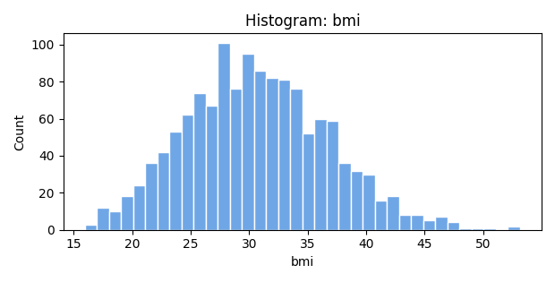 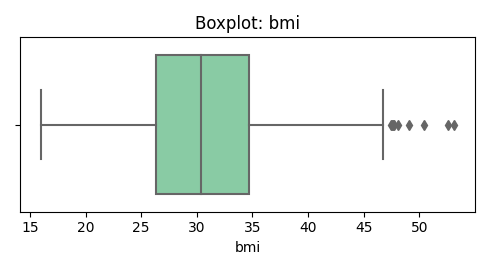

- **children**

  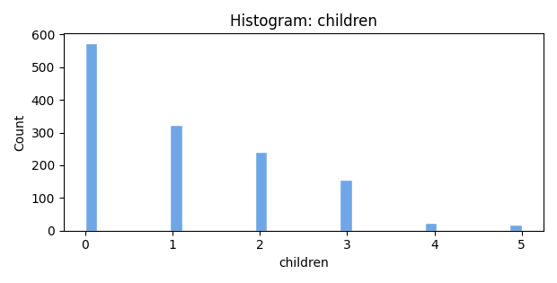 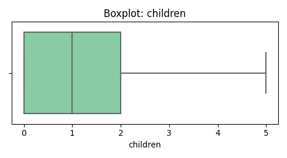

- **charges**

  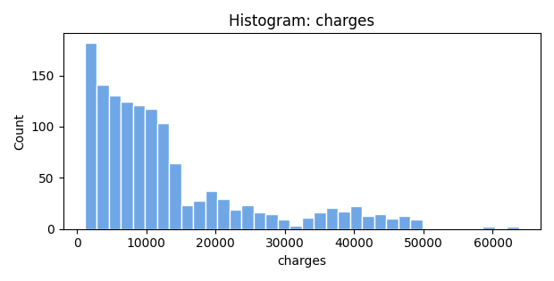 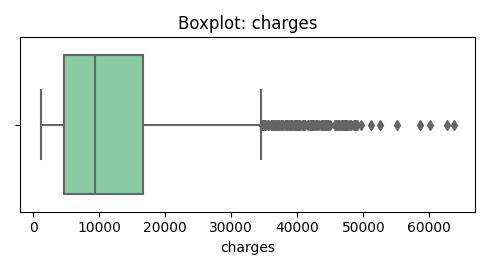

### Categorical Distributions
- **sex**

  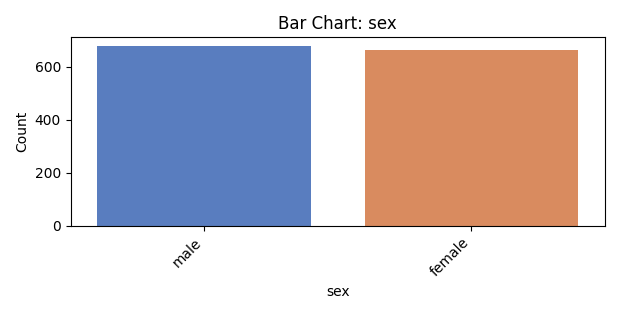

- **smoker**

  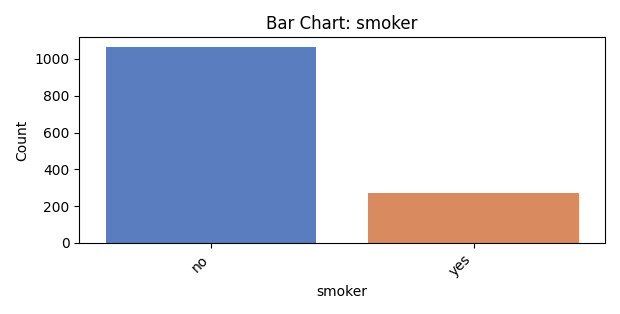

- **region**

  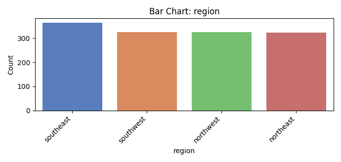

### Missingness Map

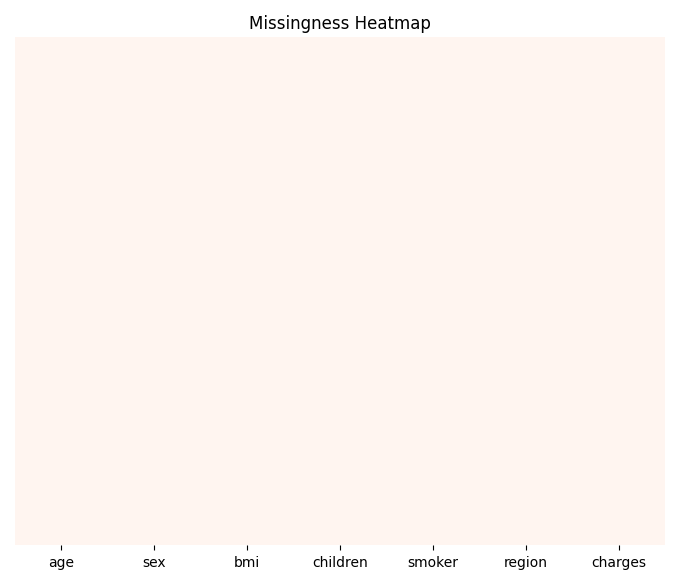

### Correlation Heatmap

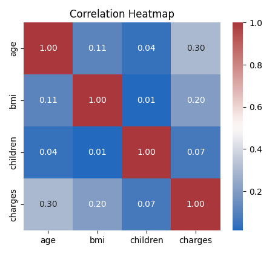

